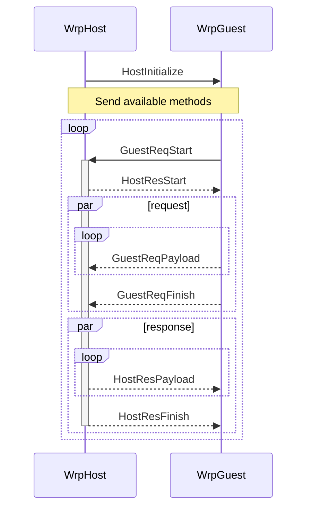

# WRP - Webview/Worker Request Protocol

pronounce as **wrap**(`ræp`)

## Design


- _Glue_ - Platform-specific code to implement sockets
- _Socket_ - Way for sending and receiving data between the two platforms
- _Channel_ - An interface that allows information to be exchanged in units of
  messages using sockets.
- _Guest_ - An interface that can send requests to hosts using channels.
- _Host_ - An interface that allows you to process and respond to requests
  received from guests.


Whenever the channel sends a message, it writes the message size as a 4-byte
little-endian integer to the socket, and then writes a message payload as that
size.

The message payload is defined in the [./src/wrp.proto](./src/wrp.proto) file.



### Types

```typescript
// Glue implementation provides socket object.
type Socket = Reader & Writer;
interface Reader {
  read(p: Uint8Array): Promise<number | null>;
}
interface Writer {
  write(p: Uint8Array): Promise<number>;
}

// Channel provides a per-message communication method.
interface WrpChannel {
  listen(): AsyncGenerator<WrpMessage>;
  send(message: WrpMessage): Promise<void>;
}

// Guest provides a way to send requests to the host.
interface WrpGuest {
  availableMethods: Set<string>;
  request(
    name: string,
    metadata: Map<string, string>,
    req: AsyncGenerator<Uint8Array>,
  ): {
    res: AsyncGenerator<Uint8Array>;
    header: Promise<Map<string, string>>;
    trailer: Promise<Map<string, string>>;
  };
}

// Host provides a way to handle and respond to requests from guests.
interface WrpHost {
  listen(): AsyncGenerator<WrpRequest>;
}
interface WrpRequest {
  methodName: string;
  metadata: Map<string, string>;
  req: AsyncGenerator<Uint8Array>;
  sendHeader(value: Map<string, string>): void;
  sendPayload(value: Uint8Array): void;
  sendTrailer(value: Map<string, string>): void;
}
```
